# 🏦 Bank Loan Portfolio Analysis — Python

An end-to-end **Bank Loan Portfolio Analysis** built in Python — transforming raw loan-level data into portfolio KPIs, segment-level activity and risk analysis, and business-ready recommendations, structured around real business questions rather than isolated Python techniques.


---

## 📌 Table of Contents

- [Overview](#-overview)
- [Business Problem](#-business-problem)
- [Dataset](#-dataset)
- [Tools & Technologies](#-tools--technologies)
- [Repository Structure](#-repository-structure)
- [Workflow](#-workflow)
- [Core Portfolio Analysis](#-core-loan-portfolio-analysis)
- [Additional Risk Insights](#-additional-risk-insights)
- [Supporting EDA](#-supporting-eda)
- [Visualizations](#-visualizations)
- [KPI Summary](#-kpi-summary)
- [Key Insights](#-key-insights)
- [Important Analytical Notes](#-important-analytical-notes)
- [Skills Demonstrated](#-skills-demonstrated)
- [How to Run](#-how-to-run)

---

## 📊 Overview

This project presents an end-to-end Bank Loan Portfolio Analysis using Python. It covers portfolio KPIs, lending activity, borrower characteristics, loan performance, observed risk patterns, and business-oriented interpretation — with the goal of producing results that are understandable, reproducible, and explainable in a Data Analyst interview.

```text
Business Understanding
        ↓
Data Loading & Inspection
        ↓
Data Quality Assessment
        ↓
Data Cleaning
        ↓
Feature Engineering
        ↓
Core Loan Portfolio Analysis
        ↓
Additional Risk Insights
        ↓
Supporting EDA
        ↓
Visualization
        ↓
KPI Summary
        ↓
Key Insights
        ↓
Business Interpretation
        ↓
Business Recommendations
```

---

## 🎯 Business Problem

The objective of the analysis is to understand the available loan portfolio and answer practical business questions such as:

- How large is the loan portfolio?
- How much has been funded?
- What are the average interest rate and DTI?
- How are loans distributed between Good and Bad Loan classifications?
- How has loan origination activity changed over time?
- Which states, loan terms, employment groups, purposes, and home-ownership categories have the largest activity?
- How does observed loan performance differ across grades and sub-grades?
- How does observed Bad Loan percentage vary across different portfolio segments?
- How does DTI differ across loan outcomes?
- What patterns should the business monitor further?

---

## 🗂️ Dataset

The project uses loan-level financial data containing fields related to:

- Loan identifiers
- Borrower state
- Employment length and employer title
- Grade and sub-grade
- Home ownership
- Issue date and payment-related dates
- Loan status
- Loan purpose
- Loan term
- Verification status
- Annual income
- DTI
- Installment
- Interest rate
- Loan amount
- Total accounts
- Total payment

| Metric | Value |
|---|---:|
| Rows | 38,576 |
| Original Columns | 24 |
| Working Columns after Feature Engineering | 25 |

---

## 🛠️ Tools & Technologies

| Tool / Library | Usage |
|---|---|
| Python | End-to-end analysis |
| Pandas | Data loading, cleaning, grouping and aggregation |
| NumPy | Conditional logic and feature creation |
| Matplotlib | Data visualization |
| Seaborn | Visualization support |
| Plotly Express | Interactive exploration |
| Jupyter Notebook | Analysis environment |
| Excel | Source dataset |

---

## 📁 Repository Structure

```text
bank-loan-analysis-python/
│
├── 01.Dataset/
│   └── financial_loan.xlsx
│
├── 02. Notebook/
│   ├── Bank Loan Analysis.ipynb
│   └── Bank Loan Analysis.pdf
│
├── 03. Documents/
│   ├── Business Problem Statement.pdf
│   └── Project Documentation.pdf
│
├── 04.Charts/
│   ├── 01_portfolio_kpis.png
│   ├── 02_good_vs_bad_loan.png
│   ├── 03_monthly_applications.png
│   ├── 04_state_application_volume.png
│   ├── 05_state_bad_loan_rate.png
│   ├── 06_term_bad_loan_rate.png
│   ├── 07_employment_length.png
│   ├── 08_purpose_bad_loan_rate.png
│   ├── 09_home_ownership.png
│   ├── 10_grade_bad_loan_rate.png
│   ├── 11_verification_bad_loan_rate.png
│   ├── 12_dti_by_loan_status.png
│   └── 13_loan_amount_distribution.png
│
└── README.md
```

| File / Folder | Description |
|---|---|
| `01.Dataset/` | Source dataset |
| `02. Notebook/` | Final Jupyter Notebook and PDF |
| `03. Documents/` | Business Problem Statement and Project Documentation |
| `04.Charts/` | Selected project visualizations displayed directly in this README |
| `README.md` | Project overview and key findings |

---

## 🔄 Workflow

**1. Problem Understanding** — translating the business requirements into analytical questions and identifying the data needed to answer them.

**2. Data Loading & Inspection** — sample records, dataset dimensions, column structure, data types, non-null counts, descriptive statistics.

**3. Data Quality Assessment** — missing values, duplicate rows, duplicate Loan IDs, duplicate Member IDs, unique-value counts, categorical values, date ranges, numeric validation rules.

> **Main quality finding:** `emp_title` contains **1,438 missing values (3.73%)**. The loan records are retained because employer title is not required for the core portfolio analysis.

**4. Data Cleaning** — standardizing text fields, converting date fields to datetime, handling the missing employer-title field using a separate reporting-friendly field, confirming duplicate checks after cleaning, re-validating cleaned fields.

**5. Feature Engineering** — Issue Year, Issue Month, Issue Month Name, Issue Year-Month, Interest Rate %, DTI %, Good/Bad Loan Category, Latest Issue Month Flag.

```text
Good Loan = Fully Paid + Current
Bad Loan  = Charged Off
```

This is an explicit analytical classification used because the supplied business requirements requested Good/Bad Loan KPIs without directly defining the status mapping.

---

## 💼 Core Loan Portfolio Analysis

### Executive Portfolio KPIs

| KPI | Value |
|---|---:|
| Total Loan Applications | 38,576 |
| Total Funded Amount | $435.76M |
| Total Loan-Level Payment | $473.07M |
| Average Interest Rate | 12.05% |
| Average DTI | 13.33% |

### MTD KPI Analysis

Latest observed Issue Date: **12-Dec-2021**

| MTD KPI | Value |
|---|---:|
| MTD Loan Applications | 4,314 |
| MTD Funded Amount | $53.98M |
| MTD Loan-Level Payment Proxy | $58.07M |

December 2021 is only observed through **12-Dec-2021**, so it represents a partial month.

### Good vs Bad Loan KPIs

| Category | Applications | Share | Funded Amount |
|---|---:|---:|---:|
| Good Loan | 33,243 | 86.18% | $370.22M |
| Bad Loan | 5,333 | 13.82% | $65.53M |

### Monthly Trends by Issue Date

| Period | Applications | Funded Amount |
|---|---:|---:|
| Jan-2021 | 2,332 | ~$25.03M |
| Dec-2021* | 4,314 | ~$53.98M |

`*` December is a partial observed month through 12-Dec-2021.

### State Analysis

**California** has the highest observed application volume: **6,894 applications**. The analysis separates portfolio concentration, funded exposure, and observed Bad Loan percentage, using meaningful-volume screening to avoid overemphasizing very small state categories.

### Loan Term Analysis

| Term | Applications | Funded Amount | Observed Bad Loan % | Avg Interest Rate |
|---|---:|---:|---:|---:|
| 36 months | 28,237 | $273.04M | 10.71% | 11.03% |
| 60 months | 10,339 | $162.72M | 22.34% | 14.83% |

### Employment Length Analysis

The **10+ years** employment group is the largest by application volume: **8,870 applications**, compared across funded amount, observed Bad Loan percentage, average DTI, and average interest rate.

### Loan Purpose Analysis

**Debt consolidation** is the largest observed loan purpose — 18,214 applications, $232.46M funded, 14.55% observed Bad Loan rate. Meaningful-volume risk screening identifies Small Business, Other, and Debt Consolidation as purposes with Bad Loan rates above the overall portfolio rate.

### Home Ownership Analysis

| Home Ownership | Applications | Funded Amount | Observed Bad Loan % | Avg DTI |
|---|---:|---:|---:|---:|
| RENT | 18,439 | $185.77M | 14.57% | 13.50% |
| MORTGAGE | 17,198 | $219.33M | 12.97% | 13.17% |
| OWN | 2,838 | $29.60M | 13.99% | 13.24% |

`RENT` is the largest category by application volume; `MORTGAGE` has the largest funded exposure.

---

## ⚠️ Additional Risk Insights

### Grade vs Bad Loan %

| Grade | Applications | Avg Interest Rate | Bad Loan % |
|---|---:|---:|---:|
| A | 9,689 | 7.35% | 5.70% |
| B | 11,674 | 11.03% | 11.50% |
| C | 7,904 | 13.55% | 16.02% |
| D | 5,182 | 15.71% | 20.69% |
| E | 2,786 | 17.71% | 24.80% |
| F | 1,028 | 19.74% | 30.25% |
| G | 313 | 21.40% | 31.31% |

These are observed segment patterns and are not treated as causal effects.

### Grade vs Interest Rate

Average interest rate also increases across the grade categories, from **7.35% for Grade A** to **21.40% for Grade G**.

### Sub-Grade Risk Drill-Down

A more detailed view within each broad grade, comparing application volume, funded exposure, average interest rate, average DTI, and observed Bad Loan percentage.

### Verification Status vs Bad Loan %

| Verification Status | Applications | Bad Loan % |
|---|---:|---:|
| Not Verified | 16,464 | 12.24% |
| Source Verified | 9,777 | 14.14% |
| Verified | 12,335 | 15.70% |

The observed rates differ across verification categories, but the analysis does not interpret verification status itself as a cause of loan performance.

### DTI vs Loan Status

| Loan Status | Applications | Avg DTI |
|---|---:|---:|
| Fully Paid | 32,145 | 13.17% |
| Charged Off | 5,333 | 14.00% |
| Current | 1,098 | 14.72% |

The project also uses a boxplot to compare the full DTI distributions across loan statuses.

### Term × Loan Status — Average Installment

Average installment is compared across loan term, loan status, and median installment, providing additional context around borrower payment amounts across term and outcome groups.

---

## 🔍 Supporting EDA

### Annual Income vs Loan Amount

A scatter plot reviews the relationship between borrower annual income and loan amount across loan-status groups.

### Loan Amount Distribution

| Metric | Loan Amount |
|---|---:|
| Mean | $11,296.07 |
| Median | $10,000 |
| 25th Percentile | $5,500 |
| 75th Percentile | $15,000 |
| 99th Percentile | $35,000 |
| Maximum | $35,000 |

---

## 🖼️ Visualizations

The most important project visuals are displayed below directly from the `04.Charts/` folder.  
You do **not** need to open the Charts folder to view them.

### Portfolio Overview

| Portfolio KPIs | Good vs Bad Loan Mix |
|---|---|
| 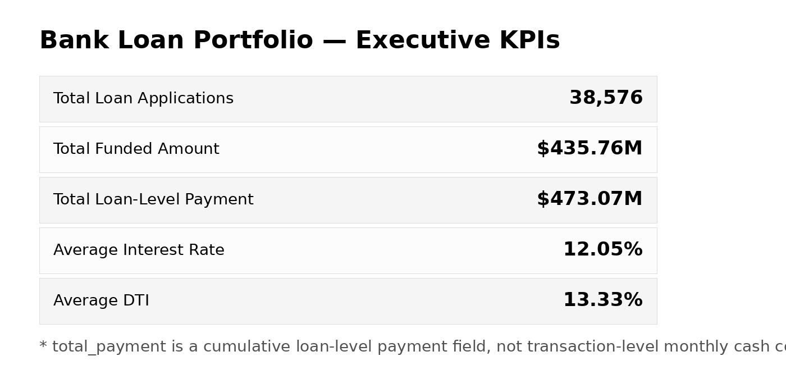 | 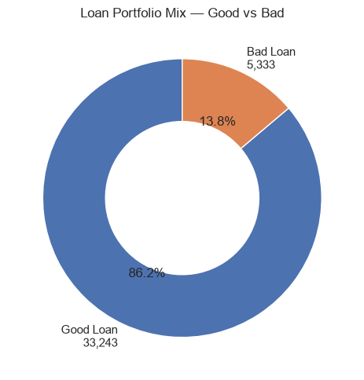 |

### Origination & Geographic Analysis

| Monthly Applications | State Application Volume |
|---|---|
| 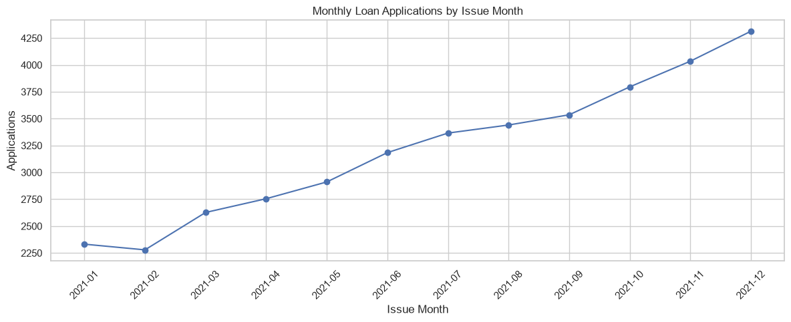 | 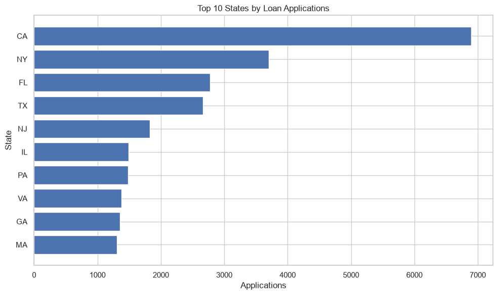 |

| State Bad Loan Rate | Loan Term Risk |
|---|---|
| 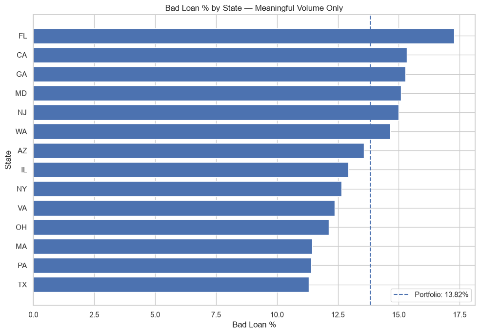 | 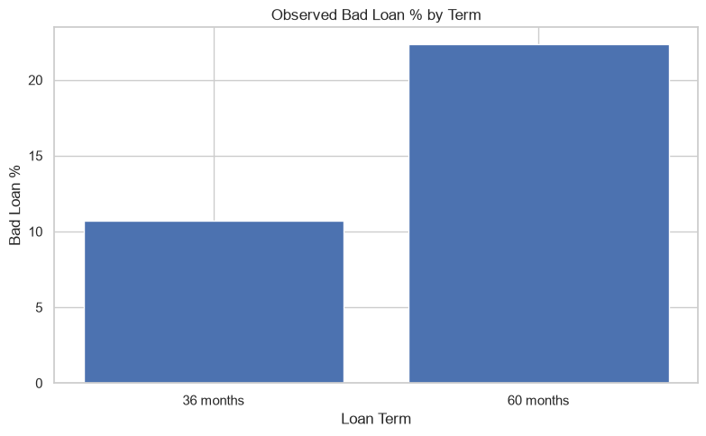 |

### Borrower & Purpose Segmentation

| Employment Length | Loan Purpose Risk |
|---|---|
| 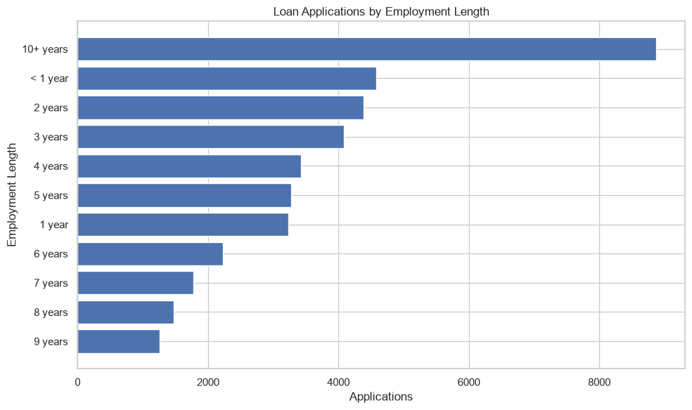 | 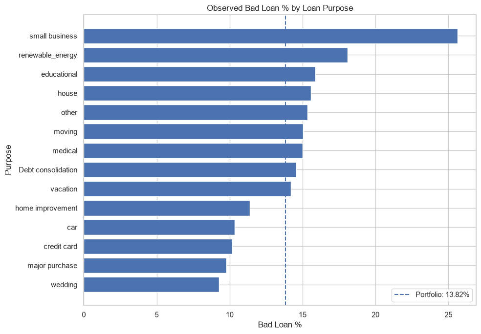 |

| Home Ownership | Grade Risk |
|---|---|
| 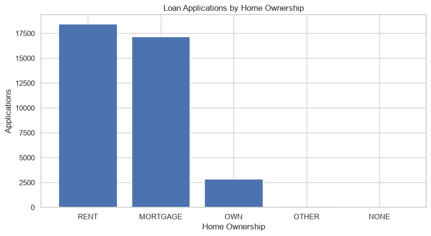 | 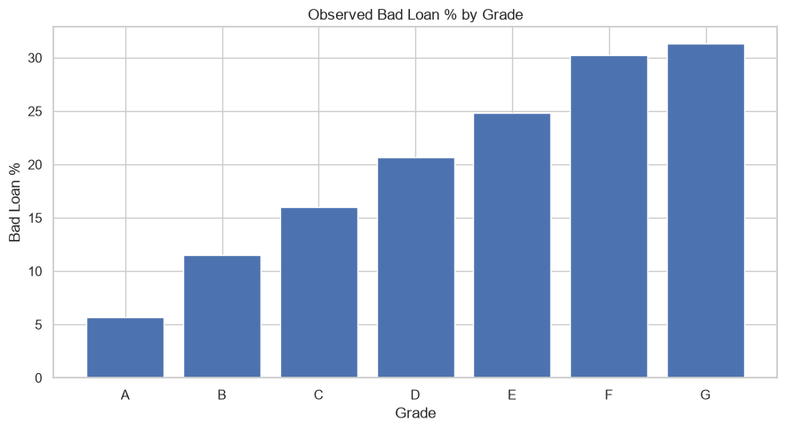 |

### Additional Risk Insights & EDA

| Verification Status | DTI by Loan Status |
|---|---|
| 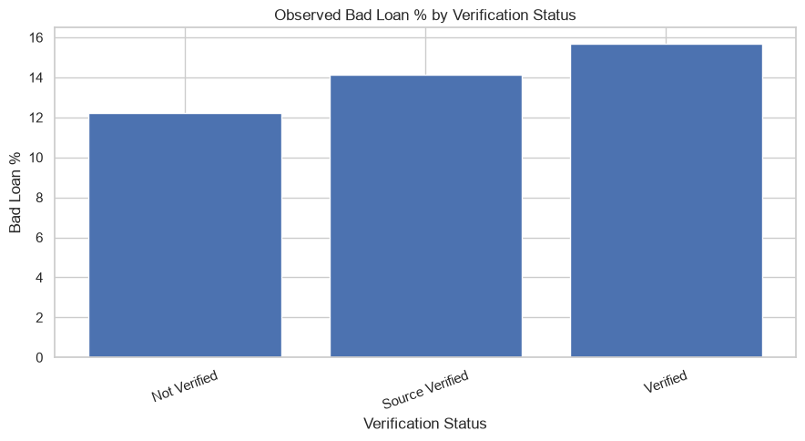 | 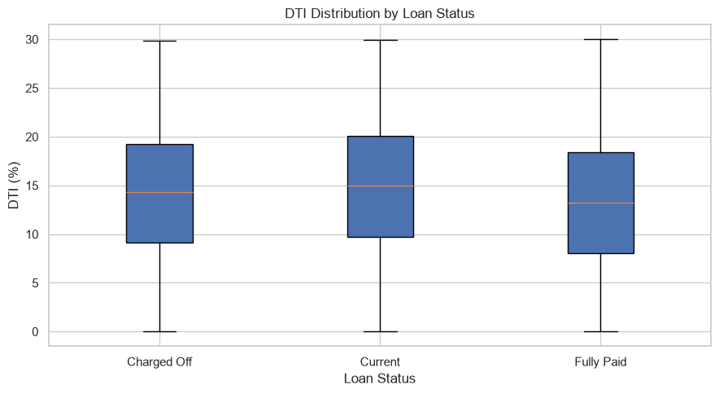 |

| Loan Amount Distribution | |
|---|---|
| 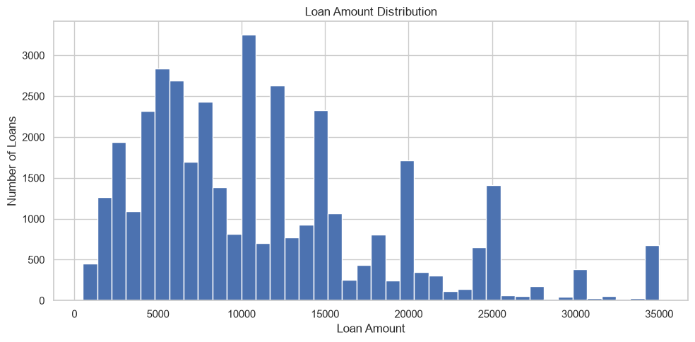 | |

---

## 📋 KPI Summary

The final notebook consolidates Portfolio KPIs, MTD KPIs, and Good vs Bad Loan KPIs into a single quick-reference view.

---

## 💡 Key Insights

**Portfolio Overview**
- 38,576 loan applications are present in the dataset.
- Approximately $435.76M has been funded.
- Average interest rate is 12.05%; average DTI is 13.33%.
- Recorded cumulative loan-level payment is approximately $473.07M.

**Loan Performance**
- 86.18% of loans are classified as Good Loans; 13.82% as Bad Loans.
- Bad Loans represent approximately $65.53M in funded principal.

**Origination Trend**
- Loan activity generally increases through the observed 2021 period — from 2,332 applications in January to 4,314 in the observed December period.
- December is partial through 12-Dec-2021.

**Portfolio Concentration**
- California has the highest application volume; 36-month loans are the dominant term.
- Debt consolidation is the largest loan purpose; 10+ years is the largest employment-length segment.
- RENT is the largest home-ownership category by volume; MORTGAGE has the largest funded exposure.

**Risk & Pricing**
- Observed Bad Loan percentages and average interest rates both increase across grades.
- Bad Loan percentages also vary by term, purpose, state, employment length, home ownership, and verification status.
- DTI distributions differ across original loan-status groups.

---

## 📝 Important Analytical Notes

**1. Loan-Level Payment Limitation** — `total_payment` is a cumulative loan-level field, not a transaction-level monthly cash-collection table. Total Amount Received is a loan-level recorded payment amount, and MTD payment is a loan-level payment proxy — not actual monthly cash collections.

**2. Partial Latest Month** — the latest available Issue Date is **12-Dec-2021**, so December 2021 figures represent only the observed period through that date.

**3. Small Categories** — very small categories can produce unstable percentages, so application counts and funded exposure should be considered together with percentage-based metrics.

**4. Descriptive Analysis** — the project describes observed differences and patterns in the available dataset. It does not establish causal relationships.

---

## 🧠 Skills Demonstrated

Python · Pandas · NumPy · Matplotlib · Seaborn · Plotly · Data Cleaning · Feature Engineering · Exploratory Data Analysis · Data Aggregation · KPI Analysis · Data Visualization · Business Analysis · Risk Segmentation · Business-Oriented Analytical Thinking

---

## ▶️ How to Run

1. Clone or download the repository.
2. Open the notebook inside `02. Notebook/`.
3. Ensure the required Python libraries are installed.
4. Confirm the dataset path used by the notebook matches the local dataset location.
5. Run the notebook from top to bottom.

---

### Final Project Perspective

This project demonstrates how a Data Analyst can move from:

**Raw Loan Data → Data Quality → Cleaning → Feature Engineering → Business Analysis → Risk Insights → Visualization → Business Interpretation → Recommendations**
---

# 👨‍💻 Author

**Nikhil Ramagiri**

Aspiring Data Analyst | SQL | Power BI | Excel | Python

📧 Email:ramagirin45@gmail.com

🔗 LinkedIn: www.linkedin.com/in/nikhil-ramagiri-21b2a324a

🔗 GitHub: https://github.com/RamagiriNikhil

---
⭐ If you found this project useful, consider giving it a star!
